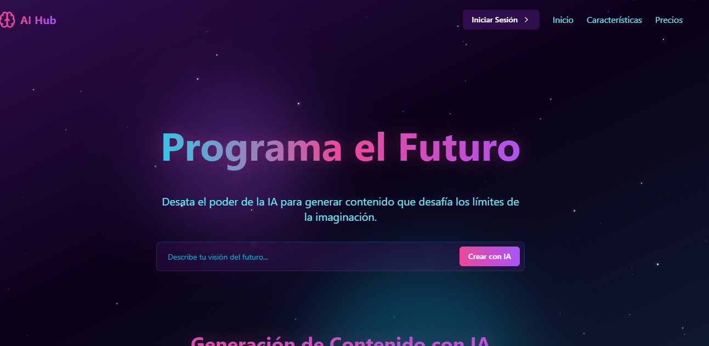
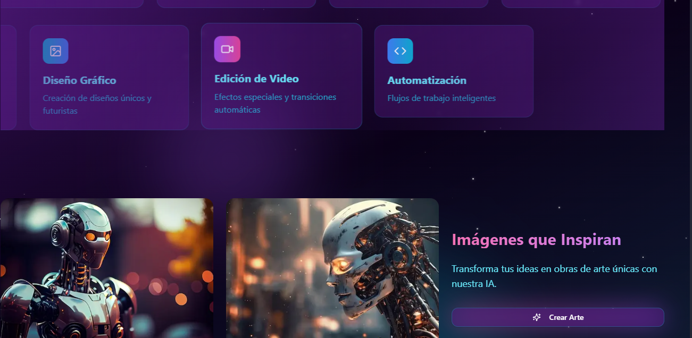
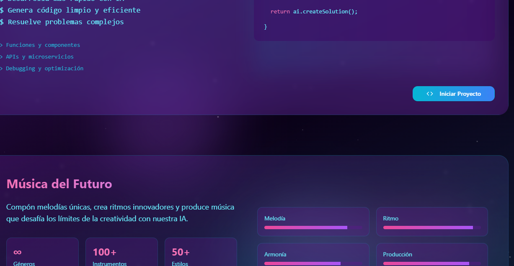
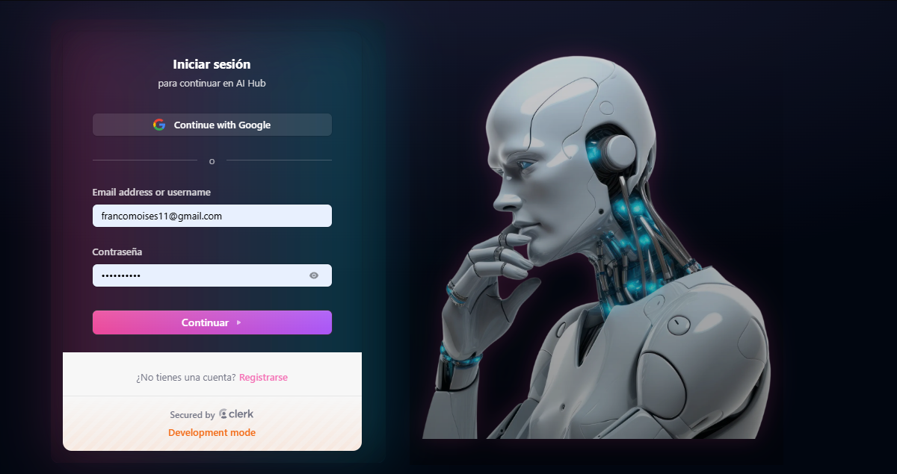
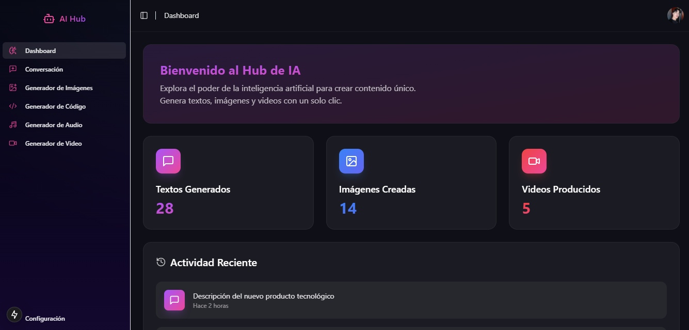
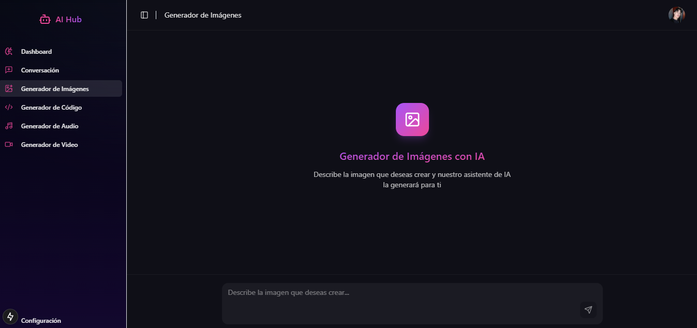

# .NET-Nextjs-AI-Hub 🚀

This project is an AI-powered content generation platform, enabling seamless creation of text, video, audio, code, and image content. Built using .NET for the backend and Next.js for the frontend, it provides a powerful and scalable solution for generating diverse media using advanced machine learning models.

## Description 💡
- **Backend**: Powered by .NET to handle API requests, data processing, and communication with AI models.
- **Frontend**: Developed with Next.js for a modern, fast, and responsive user interface.

## Setup Instructions 🛠️

### Prerequisites
Before starting, make sure you have the following installed:
- .NET SDK (version 6.0 or higher)
- Node.js (version 16.x or higher)
- npm or yarn (for frontend dependencies)

### Backend Setup
1. Navigate to the `backend/AIHub.API` directory:
   ```bash
   cd backend/AIHub.API
   ```
2. Restore the .NET dependencies:
   ```bash
   dotnet restore
   ```
3. Run the application:
   ```bash
   dotnet run
   ```

### Frontend Setup
1. Navigate to the `frontend` directory:
   ```bash
   cd frontend
   ```
2. Install dependencies:
   ```bash
   npm install
   ```
3. Create a `.env` file in the frontend directory with the following content:
   ```bash
   AI_API_KEY=<your-ai-api-key>
   AI_API_URL=<your-ai-api-url>
   Replace <your-ai-api-key> and <your-ai-api-url> with the appropriate values for your AI service.
   ```
4. Start the Next.js development server:
   ```bash
   npm run dev
   ```

### Running the Full Application
Start the backend server first, followed by the frontend server.
Open [http://localhost:3000](http://localhost:3000) in your browser to use the AI-powered content generator.

## Features 🌟
- Content generation for **text**, **video**, **audio**, **code**, and **images**.
- Integration with advanced AI models for diverse media creation.
- Scalable architecture using .NET and Next.js for optimal performance.

## Demo Video 🎥
[](https://www.youtube.com/watch?v=1MAGtbeMDmE&ab_channel=francomoises)

## Images 📸







## Author ✍️
**FJMoisesRomero**  
GitHub: [FJMoisesRomero](https://github.com/FJMoisesRomero)

## License 📜
This project is licensed under the **GPL-3.0 license**.
